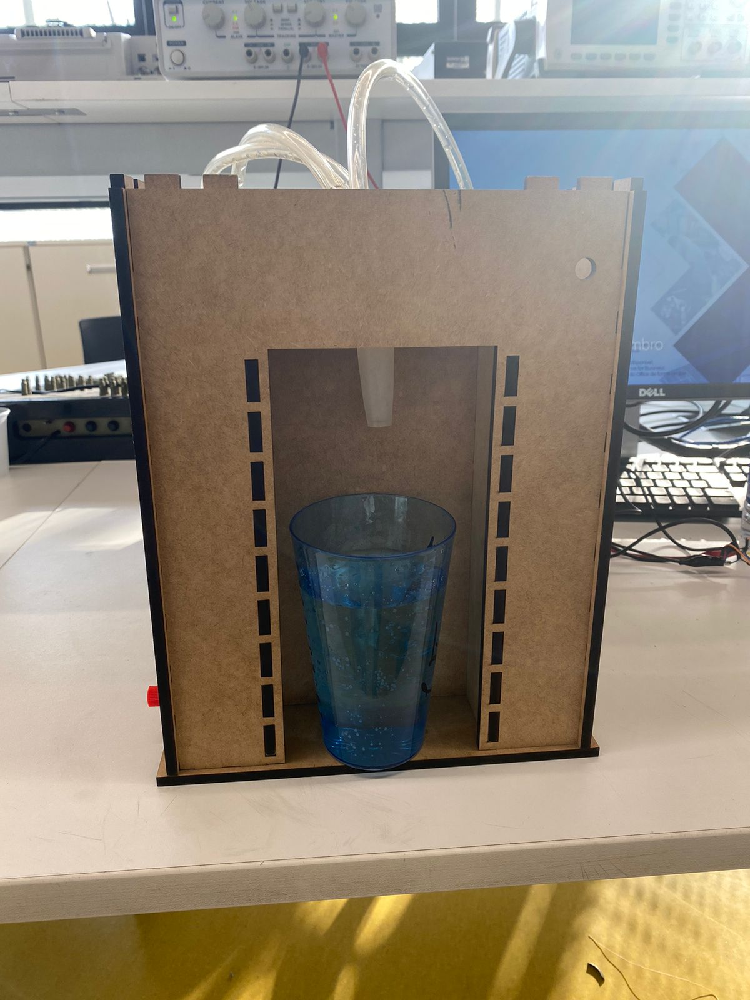
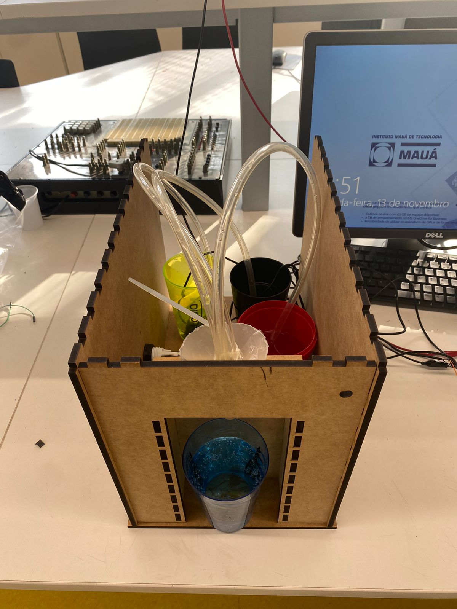
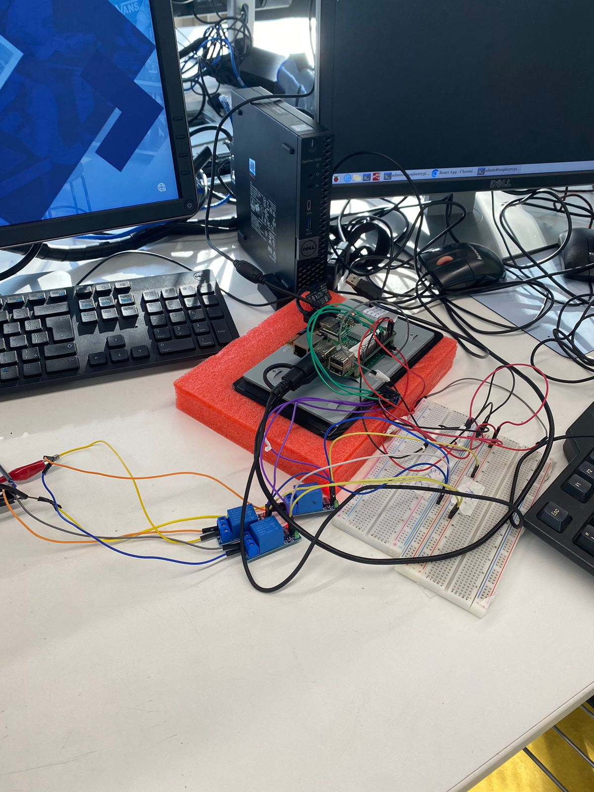
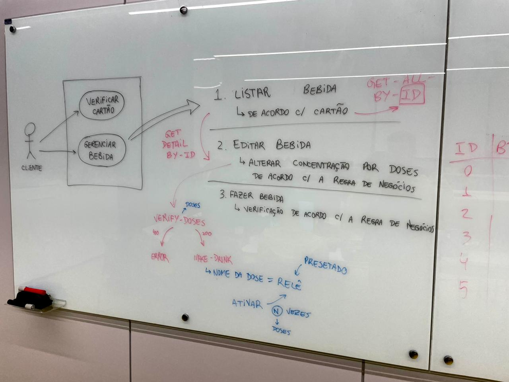
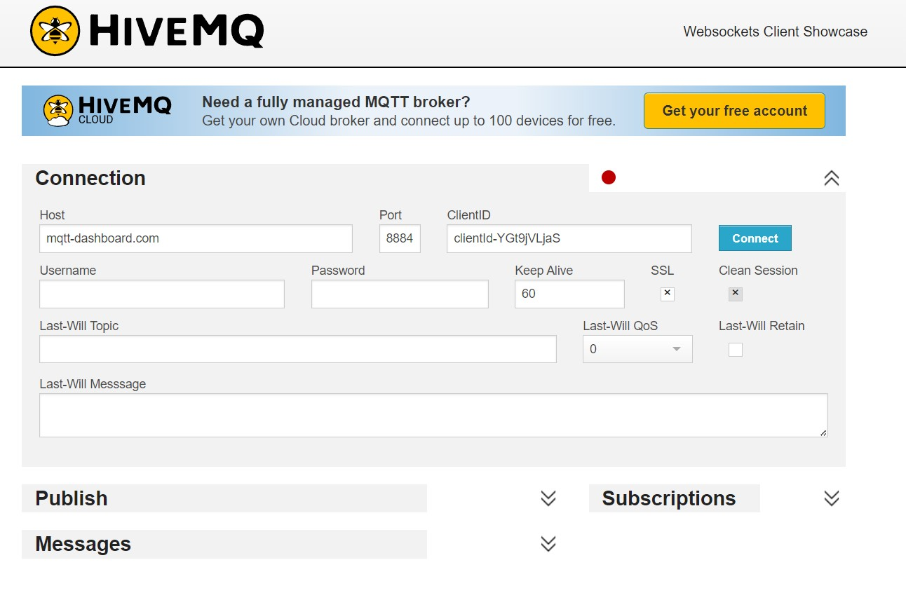

# *Drinker* de bebidas

Este projeto consiste na criação de um *drinker* de bebidas utilizando o *Raspberry Pi*. 
Em outras palavras, consiste no usuário selecionar uma bebida a partir de um site, e após selecionado, será despejada a combinação escolhida.
Foi utilizado Python, HTML, CSS e JavaScript como linguagem de programação no desenvolvimento do software.

# ENTREGA T2
# Funcionamento/Comportamento desenvolvido

- Foi feito uma aplicação React, que estará no display de 7 seguimentos. Nessa aplicação o usuário poderá ver o menu de bebidas disponíveis e selecionar a de seu desejo.
- Após selecionar a bebida, o usuário pode definir a quantidade de doses de cada componente da mistura e por fim enviar seu pedido.
- Com o envio do pedido, uma API feita em Python com Flask.API que verifica se é possível realizar o pedido de acordo com a disponibilidade das bebidas, e em caso positívo realizá-las enviando uma requisição HTTP na qual o Raspberry PI aciona os relés pelo tempo adequado.

# Diagrama de casos de uso

O funcionamento descrito acima pode ser observado de forma mais detalhada no diagrama de casos de uso abaixo.

# Vídeos demonstrativos
Caso os vídeos não estejam sendo exibidos, estão na pasta *assets/t2_video1.mp4* e *assets/t2_video2.mp4*

https://github.com/FelipeSilvieri/microcontroladores-t2-t3/assets/100360420/28301086-6d38-4787-9abf-688b1b678603

https://github.com/FelipeSilvieri/microcontroladores-t2-t3/assets/100360420/c3f6a53f-c146-43d3-af8c-1d65a7860371

# ENTREGA T3
# Funcionamento/Comportamento desenvolvido

- Foi disponibilizado o backend na nuvem utilizando o Railway, para que ele esteja funcionando 100% do tempo. Porém, como a API se comunicava diretamente com o Hardware, foi necessário realizar essa comunicação por meio de MQTT, utilizando o broker publico HiveMQ.
- Sendo assim, possível realizar seu pedido de qualquer dispositivo que esteja rodando o FrontEnd localmente.

# Vídeo demonstrativo

Caso o vídeo não esteja sendo exibido, está na pasta *assets/t3_video.mp4*

https://github.com/FelipeSilvieri/microcontroladores-t2-t3/assets/100360420/757d7adc-799a-4219-bb21-5687bf43021c

# Autores
- Davi Fernandes Simões Soares      RA: 20.01099-0
- Felipe Matos Silvieri				RA: 20.00314-5
- Gabriel dos Santos Couto			RA: 20.00273-4
